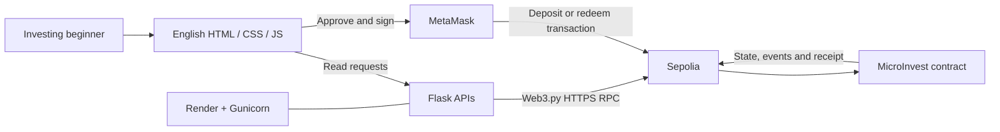

# Architecture and API

MicroInvest is a single-pool educational micro-investment workflow. A user contributes Sepolia test ETH, holds non-transferable internal shares at a fixed rate, and redeems principal on demand. No assets are invested elsewhere and no yield is modeled. Small fractional amounts make the workflow accessible to beginners without a business minimum.



The backend holds no signing key and provides no transaction submission endpoint. MetaMask and the user's network provider handle writes; Flask uses its separately configured RPC for reads. Both must use the same chain/address. The chain remains authoritative after backend restart. Browser local storage tracks the latest transaction for that wallet/pool/network and a preferred account for that pool/network; it is never a source of account balances or wallet permissions.

## Contract state and transitions

| Entry point | Validation and behavior |
| --- | --- |
| `deposit()` payable | `msg.value > 0`; increase caller's shares and `totalShares` by value; emit `Deposited` |
| `withdraw(amountWei)` | Positive amount, caller has sufficient shares, guard against reentry; debit shares and total, transfer same wei, emit `Withdrawn`; failure rolls back everything |
| `withdrawAll()` | Redeem the caller's complete nonzero position using the same withdrawal logic |
| `shares(address)` | Read internal smallest-unit share balance |
| `totalShares()` | Read total recorded redeemable principal in wei |

One ETH and one displayed share each contain `10^18` units. For example 0.001 ETH credits exactly `10^15` units, displayed as 0.001 shares. There is no ERC-20 share token, owner, administrator, transfer, pause or upgrade method. The deploying wallet is an ordinary participant. Each valid call changes only the caller's ledger entry. Successful deposits/redemptions emit indexed investor events with amount and resulting shares.

Accounting invariants under supported operations:

```text
totalShares = sum of all investor share-unit balances
redeemableWei(user) = shares(user)
contractBalanceWei >= totalShares
deposit(v):  userShares += v; totalShares += v
withdraw(v): userShares -= v; totalShares -= v; caller receives v
```

No platform fee is deducted. Gas is paid separately from the wallet. Native ETH forcibly sent outside the deposit path can produce excess balance; it creates no ledger entry or yield and has no administrative rescue path. `pool` exposes excess separately. The test-only `ForcedEther` helper uses `selfdestruct`; the business contract does not.

## Public GET APIs

Flask serves `/`, `/activity` and `/deploy`, and these JSON endpoints. All amounts in smallest units are **decimal strings**, never JSON floating-point numbers. Display decimals are also strings. Block numbers and timestamps are ordinary integers. APIs are read-only and do not authenticate public chain data.

| Route | Response / responsibility |
| --- | --- |
| `/healthz` | Process liveness: `status`, app name, whether configuration fields are present; does not contact RPC |
| `/api/config` | Public chain ID/name/hex, pool address, deployment block, explorer base, configured flag and ABI; omits RPC URL and credentials |
| `/api/artifact` | Public compiler version, ABI, creation/runtime bytecode for browser wallet deployment |
| `/api/pool` | Snapshot block, shares, recorded principal, actual balance, excess, solvency |
| `/api/position/<wallet>` | Validated checksum address, snapshot block, shares, redeemable principal and wallet balance |
| `/api/history/<wallet>?limit=20&cursor=BLOCK:LOGINDEX` | Wallet's confirmed deposits/redemptions, newest first, next cursor, scan bounds, latest block |
| `/api/transactions/<hash>` | Target pool validation; `not_found`, `pending`, `success` or `failed`, receipt block, confirmations and gas |

An example position (illustrative, not a live Sepolia account):

```json
{
  "sharesUnits": "1000000000000000",
  "shares": "0.001",
  "redeemableWei": "1000000000000000",
  "redeemableEth": "0.001"
}
```

Controlled errors use `{"error":{"code":"...","message":"..."}}`. Bad address/hash, limit or cursor returns 400. Missing setup/artifact, mismatched RPC chain, wrong bytecode or unavailable RPC returns 503. Unexpected provider messages are replaced with a safe retry message and only exception class is logged, avoiding provider credentials. Unsupported methods return 405. No error response substitutes zero for unavailable balances.

Every chain query verifies the configured chain and runtime bytecode. Pool/position amounts are read against an explicit snapshot block. A history page scans at most `HISTORY_PAGE_BLOCKS` and splits `eth_getLogs` into chunks of `LOG_CHUNK_SIZE`. Topics filter the contract's two events and the indexed investor. Only selected records require timestamp lookups.

The cursor is the exclusive `(blockNumber, logIndex)` boundary. If an event limit splits one block, the next page includes that block but excludes previously delivered logs. Once a range is exhausted, `start:0` moves to older logs. An empty range can still have a next cursor: the UI permits continuing to earlier blocks. Large inactive periods therefore need multiple page requests rather than an unbounded RPC call.

The overview requests `limit=5` and caps the displayed recent records at five. Its **View all activity** link carries the selected public wallet address to `/activity?wallet=...`. The independent read-only page requests 20 records per page and appends older cursor pages until all activity is loaded. It works from that public address without signing or wallet installation; connecting/changing an actual wallet selects its account and clears previous records. Both pages use one safe text-only table renderer. Refresh resets complete-history pagination to the newest page.

## User and transaction lifecycle

1. Read public configuration/pool; explain fixed shares, testnet, no yield and gas.
2. Connect MetaMask and select the configured network. The shared header menu lists valid addresses returned by `eth_accounts`. Selecting an address clears previous position/history and loads the selected account through Flask. The saved account preference is used only if still in that returned list. A user click on Manage accounts invokes `wallet_requestPermissions` for `eth_accounts`; simply opening the menu requests no permissions.
3. Validate positive decimal input and current redeemable balance. Recheck network and the selected address's membership in `eth_accounts` immediately before signing; the selected address need not be the first list entry. Use `getSigner(selectedAddress)` for the transaction. Account menu operations and transaction submissions temporarily disable conflicting actions. A deposit also estimates gas and checks wallet balance.
4. Request wallet approval. A rejected request is not a transaction. Once a hash exists, mark the operation pending and store the hash under its network/pool/wallet.
5. Wait for a mined receipt. Status 1 produces confirmed feedback and fresh state reads; status 0 reports revert. A replacement/cancellation is tracked separately. Timeout or connection failure preserves the hash as unknown and permits rechecking.
6. On account/network change, clear position/history and disable writes until the new context is loaded. Earlier asynchronous responses cannot overwrite a newer context.

One mined confirmation is sufficient for the coursework UI; further confirmations and chain finality should be considered for a production financial application. Successful chain events provide confirmed history. Wallet rejection has no chain event and is shown as current operation feedback, not fabricated history.

## Security, availability and deployment

Withdrawals follow checks/effects/interactions with a reentrancy lock; transfer failure reverts debits. Solidity's checked integer arithmetic and exact frontend/backend formatting avoid floating-point loss. The UI uses text nodes for event data, local scripts/libraries and a restrictive Content Security Policy. Provider credentials stay server-side. `/deploy` can be public because each visitor creates a separate pool with their own wallet; it cannot replace the running server's address or acquire special privileges.

The only accepted deployment network is Sepolia; a local chain requires explicit `LOCAL_DEVELOPMENT=true`. Render runs Gunicorn and needs no Node process, database or persistent disk. ABI/bytecode and ethers are committed build outputs. Configuration is in service environment variables, not generated server files. See README for build/start commands and the health-vs-readiness distinction.

No database reduces synchronization complexity but makes history dependent on RPC latency, range limits and availability. Queries remain bounded and retryable. No caching/indexer, user authentication, advanced portfolio management or audited real-money custody is included. These are deliberate limits of the agreed simple coursework scope.
